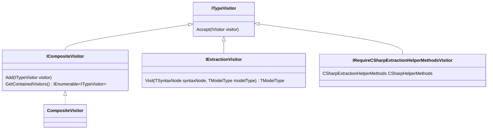
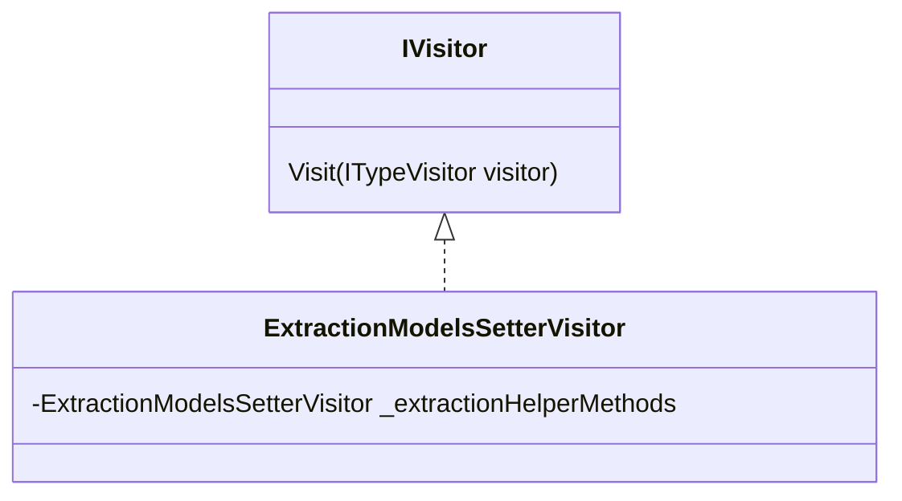

# Extractor

## Hierarchy

Below are presented the main Visitors



There are visitors for each type of the model

- ICompilationUnitVisitor
- IClassVisitor
- IDelegateVisitor
- IMethodVisitor
- IConstructorVisitor
- IFieldVisitor
- IPropertyVisitor
- IAttributeVisitor
- ILocalFunctionVisitor
- IMethodSignatureVisitor

## Add Functionality To ITypeVisitors

To add functionality to certain extraction visitors, one can declare custom visitors that extend `IVisitor`

For Example:

`IRequireCSharpExtractionHelperMethodsVisitor` defines some helper methods to be used by the extraction
visitors. `ExtractionModelsSetterVisitor` is used to set those helper functions to all.



## Defining Custom Extraction Visitor Example

Lets say we extract the name and parameters of Attributes of C# classes.

### Model Definition

First of all, we define the model that will store the relevant data of the attribute.

```c#
public class AttributeType
{
    public string Name { get; set; }
    
    public string Target { get; set; }    
}
```

### Extraction Visitor

#### Interface

Next, we define the extraction visitor's interface. To simplify the extraction and join of the attribute data, the
extraction visitor should extend the generic interface `IExtractionVisitor`.

The first parameter is the syntax element from which we want to extract data and the second parameter is our model that
holds only the relevant data.

```c#
public interface ICSharpAttributeVisitor : IExtractionVisitor<AttributeSyntax, AttributeType>
{
}
```

#### Implementation

After the extraction visitor interface is done, we can move on to its implementation

To have access certain helper methods, `AttributeInfoVisitor` can
implement `IRequireCSharpExtractionHelperMethodsVisitor`

```c#
public class AttributeInfoVisitor : ICSharpAttributeVisitor, IRequireCSharpExtractionHelperMethodsVisitor
{
    public CSharpExtractionHelperMethods CSharpHelperMethods { get; set; }

    public IAttributeType Visit(AttributeSyntax attributeSyntax, AttributeType attributeType)
    {
        // todo populate here the 'attributeType' with data from 'attributeSyntax' 
    
        return attributeType;
    }
}
```

>Note: Normally, the class `AttributeInfoVisitor` must implement `void Accept(IVisitor visitor)` method, but it's not
relevant for this example. It can be left empty.

### Adding To Attribute data to Class Model

We now have the possibility to extract data from attributes, but we need that info to be added to the class model


We define a class-type Visitor that will contain will execute the previously defined visitor for all its attributes

```c#
public class AttributeSetterClassVisitor : CompositeVisitor, ICSharpClassVisitor
{
    public AttributeSetterClassVisitor(IEnumerable<ICSharpAttributeVisitor> visitors) : base(visitors)
    {
    }

    public IClassType Visit(BaseTypeDeclarationSyntax syntaxNode, IClassType classType)
    {
        foreach (var attributeSyntax in syntaxNode.DescendantNodes().OfType<AttributeSyntax>())
        {
            AttributeType attributeModel = new AttributeType();

            foreach (var visitor in GetContainedVisitors())
            {
                if (visitor is ICSharpAttributeVisitor extractionVisitor)
                {
                    attributeModel = extractionVisitor.Visit(attributeSyntax, attributeModel);
                }
            }

            classType.Attributes.Add(attributeModel);
        }

        return classType;
    }
}
```

Let's break it down:


1. `AttributeSetterClassVisitor` extends `CompositeVisitor` because we might want to run multiple attribute-type visitors for the class' attributes 
2. `AttributeSetterClassVisitor` implements the `ICSharpClassVisitor` interface because `AttributeSetterClassVisitor` should be visitor that runs for each class of the project
3. With the help of the constructor, we can accept only visitors that run on C# classes
4. In the `Visit` method, we iterate through all the attributes of the class and run all the visitors that we received in the constructors
5. After the attribute model is populated with data from the visitor, it will be added to the attribute list 

### Use the custom Extraction Visitor

Finally, we can add our visitor to the rest of the extraction visitors that run for each file of a C# project

```c#
var compositeVisitor = new CompositeVisitor();

compositeVisitor.Add(new ClassSetterCompilationUnitVisitor(new List<ICSharpClassVisitor>
{
    new BaseInfoClassVisitor(),
    new AttributeSetterClassVisitor(new List<IAttributeVisitor>
    {
        new AttributeInfoVisitor()
    })
}));

var factExtractor = new CSharpFactExtractor(new CSharpSyntacticModelCreator(),
    new CSharpSemanticModelCreator(new CSharpCompilationMaker()), compositeVisitor);
```
