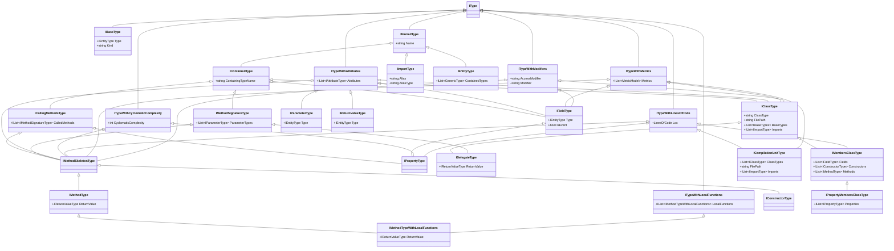

# Types

## Entire Hierarchy

```mermaid
classDiagram

IType  <|-- IBaseType
IType  <|-- INamedType
IType  <|-- ITypeWithAttributes
IType  <|-- ITypeWithCyclomaticComplexity
IType  <|-- ITypeWithLinesOfCode
IType  <|-- ITypeWithLocalFunctions
IType  <|-- ITypeWithMetrics
IType  <|-- ITypeWithModifiers

INamedType <|-- IImportType
INamedType <|-- IEntityType
INamedType <|-- IContainedType

IContainedType <|-- ICallingMethodsType
IContainedType <|-- IClassType
IContainedType <|-- IFieldType
IContainedType <|-- IMethodSignatureType

ICallingMethodsType <|-- IMethodSkeletonType
ICallingMethodsType <|-- IPropertyType
  
IMethodSkeletonType <|-- IMethodType
IMethodSkeletonType <|-- IConstructorType

IMethodType <|-- IMethodTypeWithLocalFunctions

IClassType <|-- IDelegateType
IClassType <|-- IMembersClassType

IMembersClassType <|-- IPropertyMembersClassType

IFieldType <|-- IPropertyType

IMethodSignatureType <|-- IDelegateType
IMethodSignatureType <|-- IMethodSkeletonType

ITypeWithAttributes <|-- IClassType
ITypeWithAttributes <|-- IFieldType
ITypeWithAttributes <|-- IMethodSkeletonType
ITypeWithAttributes <|-- IParameterType
ITypeWithAttributes <|-- IReturnValueType

ITypeWithCyclomaticComplexity <|-- IMethodSkeletonType
ITypeWithCyclomaticComplexity <|-- IPropertyType

ITypeWithLinesOfCode <|-- ICompilationUnitType
ITypeWithLinesOfCode <|-- IMembersClassType
ITypeWithLinesOfCode <|-- IMethodSkeletonType
ITypeWithLinesOfCode <|-- IPropertyType
    
ITypeWithLocalFunctions <|-- IMethodTypeWithLocalFunctions
    
ITypeWithMetrics <|-- IClassType
ITypeWithMetrics <|-- ICompilationUnitType
ITypeWithMetrics <|-- IFieldType
ITypeWithMetrics <|-- IMethodSkeletonType

ITypeWithModifiers <|-- IClassType
ITypeWithModifiers <|-- IFieldType
ITypeWithModifiers <|-- IMethodSkeletonType

class IBaseType{    
    +IEntityType Type
    +string Kind
}
class INamedType{
    +string Name
}
class IImportType{
  +string Alias
  +string AliasType
}
class IEntityType{
  +IList~GenericType~ ContainedTypes     
}
class IContainedType{  
    +string ContainingTypeName     
}
class ICallingMethodsType{  
    +IList~IMethodSignatureType~ CalledMethods     
}
class IClassType{ 
    +string ClassType     
    +string FilePath     
    +IList~IBaseTypes~ BaseTypes     
    +IList~IImportType~ Imports     
}
class IFieldType{ 
    +IEntityType Type
    +bool IsEvent     
}
class IMethodSignatureType{
    +IList~IParameterType~ ParameterTypes     
}
class IMethodType{
   +IReturnValueType ReturnValue
}
class IMethodTypeWithLocalFunctions{
   +IReturnValueType ReturnValue
}
class IDelegateType{
    +IReturnValueType ReturnValue
}
class IMembersClassType{
    +IList~IFieldType~ Fields
    +IList~IConstructorType~ Constructors
    +IList~IMethodType~ Methods
}
class IPropertyMembersClassType{
    +IList~IPropertyType~ Properties
}
class ITypeWithAttributes{
    +IList~IAttributeType~ Attributes
}
class IParameterType{
    +IEntityType Type
}
class IReturnValueType{
    +IEntityType Type
}
class ITypeWithCyclomaticComplexity{
    +int CyclomaticComplexity
}
class ITypeWithLinesOfCode{
    +LinesOfCode Loc
}
class ICompilationUnitType{
    +IList~IClassType~ ClassTypes
    +string FilePath
    +IList~IImportType~ Imports
}
class ITypeWithLocalFunctions{
    +IList~IMethodTypeWithLocalFunctions~ LocalFunctions
}
class ITypeWithMetrics{
    +IList~MetricModel~ Metrics
}
class ITypeWithModifiers{        
    +string AccessModifier
    +string Modifier
}
```
